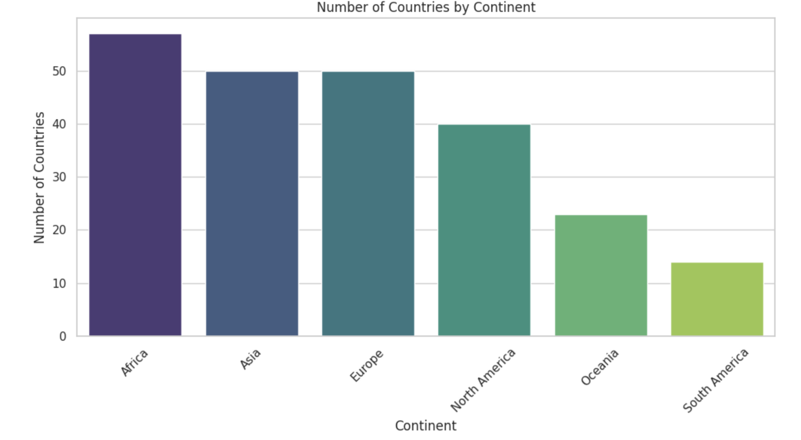
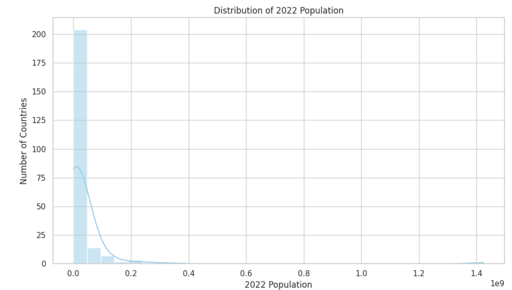
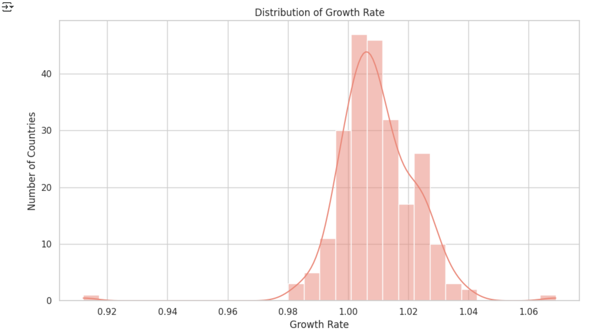
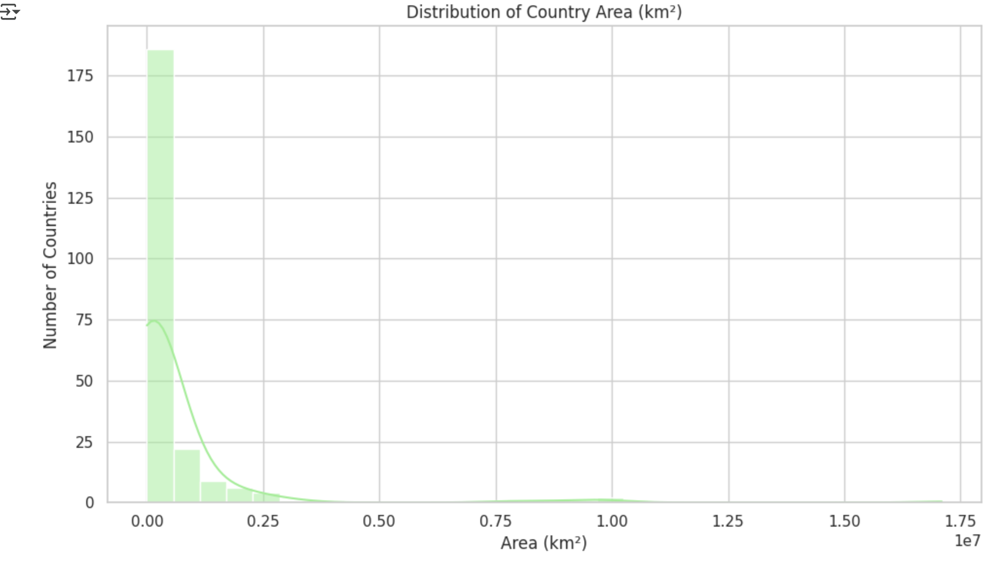

# 🌍 PRODIGY_DS_01 - World Population Visualization

This project is part of the **PRODIGY Data Science Internship** program.  
We use Python to explore and visualize the **World Population dataset**, highlighting key insights through:

### 📊 Visualizations
- 📌 Bar Chart: Number of countries per continent
- 📌 Histogram: 2022 Population distribution
- 📌 Histogram: Growth rate of countries
- 📌 Histogram: Area (in km²)

### 📁 Files in This Repository
| File | Description |
|------|-------------|
| `world_population.csv` | Dataset used for visualization |
| `PRODIGY_DS_01.ipynb` | Jupyter Notebook with Python code |
| `screenshots/` | Folder containing output images |
| `README.md` | Project documentation |

### 🛠️ Libraries Used
- `pandas`
- `matplotlib`
- `seaborn`

### 📷 Output Samples
#### Bar Chart

#### Population Histogram

#### Growth Rate Histogram

#### Area Histogram

---

### ✅ Output Insights
- Most countries are in **Africa**, followed by Asia and Europe.
- Population is heavily **right-skewed** due to a few highly populous countries.
- Most countries have a **growth rate near 1**, indicating slow but steady growth.
- Land area also shows large variance — few large, many small.

---

### 🏁 Internship Task:
- ✅ Dataset Understanding
- ✅ Visual Representation
- ✅ Interpretation & Inference

---

